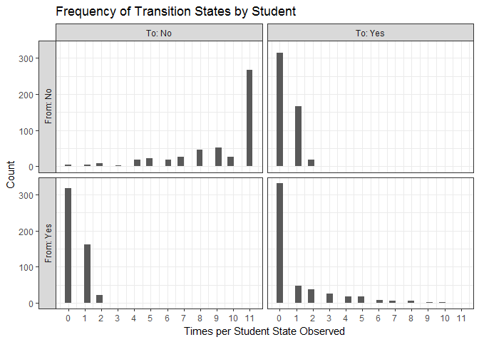
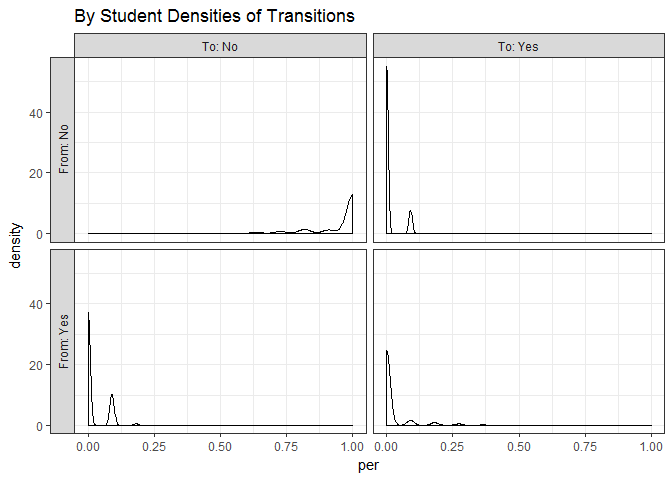

<!-- README.md is generated from README.Rmd. Please edit that file -->
OpenSDP Data
============

A project to generate realistic synthetic unit-level longitudinal education data.

Design Goals
------------

1.  Generate synthetic education data that is realistic for use by analysts across the education sector. Realistic means messy, and reflective of the general pattern of relationships found in the U.S. education sector.
2.  Synthetic data should be able to be generated on-demand and responsive to inputs from the user. These inputs should allow the user to configure the process to produce data that resembles the patterns of data in their agency.
3.  The package should be modular and extendable allowing new data topics to be generated as needed so synthetic data coverage can grow.

Get Started
===========

To use `OpenSDP.data`, follow the instructions below:

Install Package
---------------

``` r
devtools::install_github("strategicdataproject/OpenSDP.data")
```

Make some data
--------------

Ljoad the package

``` r
library(OpenSDP.data)
#> Loading required package: dplyr
#> 
#> Attaching package: 'dplyr'
#> The following objects are masked from 'package:stats':
#> 
#>     filter, lag
#> The following objects are masked from 'package:base':
#> 
#>     intersect, setdiff, setequal, union
```

``` r
out <- simpop(nstu = 500, seed = 213, control = sim_control(nschls = 3))
#> Preparing student identities for 500 students...
#> Creating annual enrollment for 500 students...
#> Assigning 500 students to initial FRPL, IEP, and ELL status
#> Organizing status variables for you...
#> Assigning 500 students longitudinal status trajectories...
#> Sorting your records
#> Cleaning up...
#> Assiging grades...
#> Creating 3 schools for you...
#> Assigning 9445 student-school enrollment spells...
#> Success! Returning you student and student-year data in a list.
head(out$demog_master %>% arrange(sid) %>% select(1:4))
#>   sid    Sex  Birthdate                         Race
#> 1 001   Male 1997-03-03 Hispanic or Latino Ethnicity
#> 2 002   Male 1992-12-13                        White
#> 3 003 Female 1998-10-05                        White
#> 4 004 Female 1993-12-16                        White
#> 5 005 Female 1995-03-27                        White
#> 6 006 Female 1995-01-24                        White
head(out$stu_year, 10)
#> Source: local data frame [10 x 9]
#> Groups: sid [10]
#> 
#>       sid  year   age  frpl   ell   iep gifted  grade schid
#>    <fctr> <int> <dbl> <chr> <chr> <chr>  <chr> <fctr> <chr>
#> 1     002  1997     5     1     0     0      0     KG     2
#> 2     010  1997     5     1     0     0      0     KG     3
#> 3     011  1997     5     1     0     0      0     KG     2
#> 4     012  1997     4     0     0     0      0     PK     1
#> 5     013  1997     5     0     0     0      1     KG     2
#> 6     014  1997     5     0     0     0      1     KG     2
#> 7     018  1997     6     0     0     0      0      1     2
#> 8     021  1997     5     1     0     0      0     KG     2
#> 9     022  1997     6     1     0     0      0      1     2
#> 10    024  1997     6     1     0     0      0      1     1
```

Parameters
----------

Default parameters can be modified by the user:

``` r
names(sim_control())
#>  [1] "nschls"             "race_groups"        "race_prob"         
#>  [4] "minyear"            "maxyear"            "gifted_list"       
#>  [7] "iep_list"           "ses_list"           "ell_list"          
#> [10] "n_cohorts"          "school_means"       "school_cov_mat"    
#> [13] "school_names"       "gpa_sim_parameters"
sim_control()$ell_list
#> $ALL
#> $ALL$f
#> function (n, tm, ...) 
#> {
#>     stopifnot(is.matrix(tm))
#>     stopifnot(n > 0)
#>     if (any(tm > 1)) {
#>         warning("TM elements exceed 1, adjusting by dividing by rowSums")
#>         tm <- tm/rowSums(tm)
#>     }
#>     mc <- new("markovchain", transitionMatrix = tm)
#>     series <- markovchainSequence(n, mc, ...)
#>     return(series)
#> }
#> <environment: namespace:OpenSDP.data>
#> 
#> $ALL$pars
#> $ALL$pars$tm
#>            1          0
#> 1 0.97560976 0.02439024
#> 0 0.00621118 0.99378882
#> 
#> 
#> 
#> $GROUPVARS
#> [1] "ell"
```

These set some of the simulation requirements, but others are set using the `baseline` function family.

``` r
get_baseline("ses")
#> $data
#>          race  prob
#> 1       black 0.650
#> 2       asian 0.375
#> 3    hispanic 0.600
#> 4     amerind 0.400
#> 5       white 0.400
#> 6       other 0.400
#> 7 multiracial 0.400
#> 8 hawaiian_pi 0.400
#> 
#> $keys
#> [1] "race"
#> 
#> $fun
#> function (x) 
#> rbinom(1, 1, x)
#> <environment: 0x000000001245c748>
```

### Diagnostics

How do we know it worked? We can look at the patterns of ELL enrollment that are observed and see what patterns are the most common. To do this, let's compute the frequency of transition states observed per student.

``` r
library(ggplot2)
library(tidyr)
plotdf <- stu_year %>% arrange(sid, year) %>% group_by(sid) %>% 
  do(tidy_sequence(.$ell, states = c(1, 0)))

plotdf$total <- rowSums(plotdf[, -1])
plotdf <- plotdf %>% gather(-sid, key = "Transition", value = "Count")

# plotdf %>% group_by(Transition) %>% filter(Transition != "total") %>%
#   summarize(sum(Count))

plotdf <- plotdf %>% filter(Transition != "total")  %>% 
  group_by(sid) %>% 
  mutate(total = sum(Count)) %>% 
  mutate(per = Count / total) %>% filter(Transition != "total")  %>% 
  separate(Transition, into = c("From", "To"), sep = "-") 

ggplot(plotdf, aes(Count)) + geom_histogram() + 
  scale_x_continuous(breaks = c(0:25)) + 
  facet_grid(From~To, labeller = label_both, switch = "y") + 
  theme_bw() + 
  labs(title = "Frequency of Transition States by Student - ELL", 
       y = "Count", x = "Times per Student State Observed")
```



Looking at this chart we can see that most students went from the No state to a No state -- as would be expected when there are few ELLs.

Through this process we've gained students in the ELL status who were not initially ELL. Depending on our application this may not be desirable and we may want to modify the transition matrix to avoid this. Otherwise, later, this becomes an exercise in data cleaning.

Two other visual diagnostics are below.

``` r
# Other plots

# ggplot(plotdf, aes(per)) + geom_density() + 
#   facet_grid(From ~ To, labeller = label_both, switch = "y") + 
#   theme_bw() + labs(title = "By Student Densities of Transitions")

# Heatmap
plotdf %>% group_by(From, To) %>% 
  summarise(Count = sum(Count)) %>% 
  ungroup %>% 
  mutate(total = sum(Count)) %>%
  mutate(per = Count/total) %>%
ggplot(aes(x = From, y = To, fill = per)) + 
  geom_tile(color= I("black")) + 
  geom_text(aes(label = round(per, digits = 2))) + 
  theme_minimal() +
  coord_cartesian() + labs(title = "Heatmap of ELL Transition States")
```



We can also do a comparative diagnostic. Given the relatively short length of our sequence per student, it will be hard to estimate fit from a short sequence.

``` r
# series <- stu_year$ell[stu_year$ID == "1705"]
# series <- stu_year$ell[stu_year$ID == "0001"]

test_fit <- function(series, expected){
  if(dim(table(series)) == 1){
    return(TRUE)
  } else {
  out <- fit_series(series, return = "fit", confidencelevel = 0.99, 
                    possibleStates = rownames(expected))
  low <- out$lowerEndpointMatrix < expected
  hi <- out$upperEndpointMatrix > expected
  return(all(low, hi))
  }
}

defaultFit <- sim_control()$ell_list$ALL$pars$tm

test_res <- stu_year %>% group_by(sid) %>% 
  summarize(fit_ok = test_fit(ell, expected = defaultFit))

table(test_res$fit_ok)
#> 
#> FALSE  TRUE 
#>    57   443
```

Let's look at co-occurrence of status over time.

``` r
# Look at by year patterns of relationships by student year
table(FRL = stu_year$frpl, GIFTED = stu_year$gifted)
#>    GIFTED
#> FRL    0    1
#>   0 4573  562
#>   1 3862  448
table(FRL = stu_year$frpl, IEP = stu_year$iep)
#>    IEP
#> FRL    0    1
#>   0 3499 1636
#>   1 3099 1211
table(GIFTED = stu_year$gifted, IEP = stu_year$iep)
#>       IEP
#> GIFTED    0    1
#>      0 5908 2527
#>      1  690  320
```

Let's check polychoric correlations:

``` r
gamma_GK(stu_year$gifted, stu_year$iep)
#> $gamma
#> [1] 0.04042992
#> 
#> $se
#> [1] 0.05093801
#> 
#> $z
#> [1] 0.7937083
#> 
#> $sig
#> [1] 0.4273653
gamma_GK(stu_year$frpl, stu_year$iep)
#> $gamma
#> [1] -0.08946517
#> 
#> $se
#> [1] 0.03172818
#> 
#> $z
#> [1] -2.819738
#> 
#> $sig
#> [1] 0.004806281
gamma_GK(stu_year$frpl, stu_year$ell)
#> $gamma
#> [1] 0.05761303
#> 
#> $se
#> [1] 0.0500866
#> 
#> $z
#> [1] 1.150268
#> 
#> $sig
#> [1] 0.2500334
```

Finally, let's see who winds up "ever" in each category

``` r

test_df <- stu_year %>% group_by(sid) %>% 
  summarize(iep_ever = if_else(any(iep == 1), "Yes", "No"), 
            ell_ever = if_else(any(ell == 1), "Yes", "No"), 
            frpl_ever = if_else(any(frpl == 1), "Yes", "No"), 
            gifted_ever = if_else(any(gifted == 1), "Yes", "No"))

table(IEP_EVER = test_df$iep_ever)
#> IEP_EVER
#>  No Yes 
#> 200 300
table(ELL_EVER = test_df$ell_ever)
#> ELL_EVER
#>  No Yes 
#> 421  79
table(FRPL_EVER = test_df$frpl_ever)
#> FRPL_EVER
#>  No Yes 
#>  48 452
table(GIFTED_EVER = test_df$gifted_ever)
#> GIFTED_EVER
#>  No Yes 
#> 431  69
```

Assigning Schools and Outcomes
------------------------------

Students move through grades, schools, and outcomes.

Package Dependencies
--------------------

-   `dplyr`
-   `lubridate`
-   [wakefield](https://www.github.com/trinker/wakefield)

OpenSDP
-------

`OpenSDP.data` is part of the OpenSDP project.
