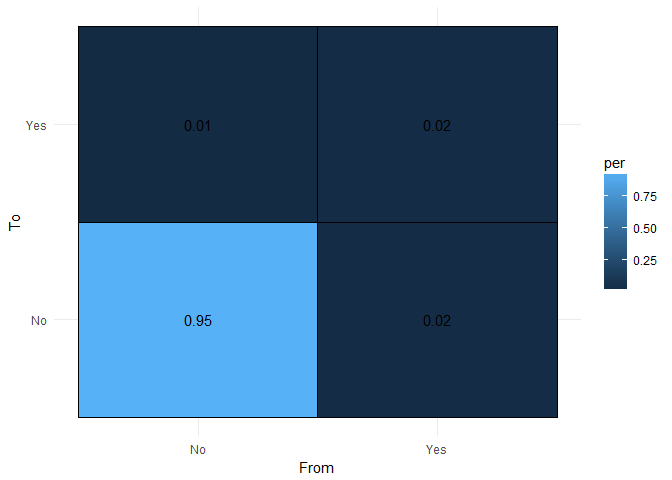

<!-- README.md is generated from README.Rmd. Please edit that file -->
OpenSDP Data
============

A project to generate realistic synthetic unit-level longitudinal education data.

Design Goals
------------

1.  Generate synthetic education data that is realistic for use by analysts across the education sector. Realistic means messy, and reflective of the general pattern of relationships found in the U.S. education sector.
2.  Synthetic data should be able to be generated on-demand and responsive to inputs from the user. These inputs should allow the user to configure the process to produce data that resembles the patterns of data in their agency.
3.  The package should be modular and extendable allowing new data topics to be generated as needed so synthetic data coverage can grow.

Get Started
===========

To use `OpenSDP.data`, follow the instructions below:

Install Package
---------------

``` r
devtools::install_github("strategicdataproject/OpenSDP.data")
```

Make some data
--------------

Using the `wakefield` package we can generate a simple set of demographic data.

``` r
library(OpenSDP.data)
library(magrittr)
library(wakefield)
library(lubridate)
set.seed(612)

demog_master <- r_data_frame(n = 2000, 
                             id(random = TRUE), 
                             sex, 
                             # dob, set range of years available for birth
                             dob(start = Sys.Date() - 365 * 25, 
                                 k = 365 * 8, by = "1 days"), 
                             race(x = c("White", "Hispanic or Latino Ethnicity", 
                                        "Black or African American", 
                                        "Asian", "American Indian or Alaska Native", 
                                        "Native Hawaiian or Other Pacific Islander", 
                                        "Demographic Race Two or More Races"), 
                                  prob = c(0.637, 0.163, 0.122, 0.047, .007, .0015, .021)))

head(demog_master)
#> # A tibble: 6 × 4
#>      ID    Sex        DOB                         Race
#>   <chr> <fctr>     <date>                       <fctr>
#> 1  1304 Female 1999-02-16 Hispanic or Latino Ethnicity
#> 2  1006   Male 1993-06-13 Hispanic or Latino Ethnicity
#> 3  0546 Female 1999-04-23 Hispanic or Latino Ethnicity
#> 4  0356 Female 1993-12-07                        White
#> 5  0324 Female 1996-05-01                        White
#> 6  0989   Male 1999-03-17 Hispanic or Latino Ethnicity
```

Next, let's break the "Race" variable into a series of indicator variables.

``` r
demog_master %<>% make_inds("Race")
demog_master %<>% mutate_at(5:11, 
                        funs(recode(., `0` = "No", `1` = "Yes")))
head(demog_master[, 4:9])
#>                           Race White Hispanic.or.Latino.Ethnicity
#> 1 Hispanic or Latino Ethnicity    No                          Yes
#> 2 Hispanic or Latino Ethnicity    No                          Yes
#> 3 Hispanic or Latino Ethnicity    No                          Yes
#> 4                        White   Yes                           No
#> 5                        White   Yes                           No
#> 6 Hispanic or Latino Ethnicity    No                          Yes
#>   Black.or.African.American Asian American.Indian.or.Alaska.Native
#> 1                        No    No                               No
#> 2                        No    No                               No
#> 3                        No    No                               No
#> 4                        No    No                               No
#> 5                        No    No                               No
#> 6                        No    No                               No
```

Now, let's generate some variables conditional on `race`. To do this we build a list that defines the distribution of this new variable for each category of the factor level.

``` r
# List of conditional probabilties
ses_list <- list("White" = list(f = rnorm, 
                                pars = list(mean = 0.3, sd = 1.1)), 
                 "Hispanic or Latino Ethnicity" = list(f = rnorm, 
                                pars = list(mean = -0.1, sd = 0.9)),
                 "Black or African American" = list(f = rnorm, 
                                pars = list(mean = -0.2, sd = 1.2)), 
                    "Asian" = list(f = rnorm, 
                                pars = list(mean = 0.23, sd = 1.2)), 
                 "Demographic Race Two or More Races" = list(f = rnorm, 
                                pars = list(mean = 0.0, sd = 1)), 
                 "American Indian or Alaska Native" = list(f = rnorm, 
                                pars = list(mean = -0.2, sd = 1)), 
                    "Other" = list(f = rnorm, 
                                pars = list(mean = 0, sd = 1)),
                 "Native Hawaiian or Other Pacific Islander" = list(f = rnorm, 
                                pars = list(mean = 0, sd = 1))
                    )

ses_list_b <- list("White" = list(f = rbinom, 
                                pars = list(size = 1, prob = 0.4)), 
                 "Hispanic or Latino Ethnicity" = list(f = rbinom, 
                              pars = list(size = 1, prob = 0.6)),
                 "Black or African American" = list(f = rbinom, 
                              pars = list(size = 1, prob = 0.65)), 
                 "Asian" = list(f = rbinom, 
                                pars = list(size = 1, prob = 0.375)), 
                 "Demographic Race Two or More Races" = list(f = rbinom, 
                                pars = list(size = 1, prob = 0.4)), 
                 "American Indian or Alaska Native" = list(f = rbinom, 
                              pars = list(size = 1, prob = 0.4)), 
                 "Other" = list(f = rbinom, 
                                pars = list(size = 1, prob = 0.4)),
                 "Native Hawaiian or Other Pacific Islander" = list(f = rbinom, 
                                  pars = list(size = 1, prob = 0.4))
)

# Note that cond_prob returns the whole data object
demog_master <- as.data.frame(demog_master)
demog_master <- cond_prob(demog_master, factor = "Race", 
                 newvar = "ses", prob_list = ses_list_b)

head(demog_master)
#>     ID    Sex        DOB                         Race White
#> 1 1304 Female 1999-02-16 Hispanic or Latino Ethnicity    No
#> 2 1006   Male 1993-06-13 Hispanic or Latino Ethnicity    No
#> 3 0546 Female 1999-04-23 Hispanic or Latino Ethnicity    No
#> 4 0356 Female 1993-12-07                        White   Yes
#> 5 0324 Female 1996-05-01                        White   Yes
#> 6 0989   Male 1999-03-17 Hispanic or Latino Ethnicity    No
#>   Hispanic.or.Latino.Ethnicity Black.or.African.American Asian
#> 1                          Yes                        No    No
#> 2                          Yes                        No    No
#> 3                          Yes                        No    No
#> 4                           No                        No    No
#> 5                           No                        No    No
#> 6                          Yes                        No    No
#>   American.Indian.or.Alaska.Native
#> 1                               No
#> 2                               No
#> 3                               No
#> 4                               No
#> 5                               No
#> 6                               No
#>   Native.Hawaiian.or.Other.Pacific.Islander
#> 1                                        No
#> 2                                        No
#> 3                                        No
#> 4                                        No
#> 5                                        No
#> 6                                        No
#>   Demographic.Race.Two.or.More.Races ses
#> 1                                 No   0
#> 2                                 No   0
#> 3                                 No   1
#> 4                                 No   0
#> 5                                 No   0
#> 6                                 No   1
```

Now we have basic individual demographics, let's add annual attributes.

``` r
## Generate student-year data
minyear <- 1997
maxyear <- 2016
stu_year <- vector(mode = "list", nrow(demog_master))

# Make a list of dataframes, one for each student, for each year
for(i in 1:nrow(demog_master)){
  tmp <- expand_grid_df(demog_master[i, c(1, 3)], 
                        data.frame(year = 1:12))
  
  tmp$year <- lubridate::year(tmp$DOB + (tmp$year + 4) * 365)
  tmp$year - lubridate::year(tmp$DOB)
  stu_year[[i]] <- tmp; rm(tmp)
}

stu_year <- bind_rows(stu_year) %>% as.data.frame()
stu_year$age <- age_calc(dob = stu_year$DOB, 
                         enddate = as.Date(paste0(stu_year$year, "-09-21")),
                         units = "years", precise = TRUE)

head(stu_year)
#>     ID        DOB year       age
#> 1 1304 1999-02-16 2004  5.592896
#> 2 1304 1999-02-16 2005  6.594521
#> 3 1304 1999-02-16 2006  7.594521
#> 4 1304 1999-02-16 2007  8.594521
#> 5 1304 1999-02-16 2008  9.592896
#> 6 1304 1999-02-16 2009 10.594521
```

ELL is a good example. A student's initial ELL status determines future ELL status to a high degree. To generate a student's ELL status over time, first the initial ELL status of a student needs to be set. Below, a dataframe of the first observation for each student in the dataset is created, this contains the `ID`, `year`, `age` in years, and `Race` of the student.

``` r
# Create ELL
### Initial
## Identify first enrollment period for a student
## Look up probability based on age/race of being ELL
## Assign student to ELL status or not in first year

stu_first <- stu_year %>% group_by(ID) %>% 
  mutate(flag = if_else(age == min(age), 1, 0)) %>% 
  filter(flag == 1) %>% select(-flag) %>% as.data.frame() %>% 
  select(ID, year, age)
stu_first <- inner_join(stu_first, demog_master[, c("ID", "Race")])
stu_first$age <- round(stu_first$age, 0)
head(stu_first)
#>     ID year age                         Race
#> 1 1304 2004   6 Hispanic or Latino Ethnicity
#> 2 1006 1998   5 Hispanic or Latino Ethnicity
#> 3 0546 2004   5 Hispanic or Latino Ethnicity
#> 4 0356 1998   5                        White
#> 5 0324 2001   5                        White
#> 6 0989 2004   6 Hispanic or Latino Ethnicity
```

To assign students to inital ELL status, we need three things:

1.  A function that generates a random status ("ELL", "Not ELL")
2.  Parameters that define the probability of being in those two statuses
3.  A baseline of observed probabilities defined by those baselines

For ELL status, age and race are strong determinants of initial ELL status. Some racial groups are much more likely to be ELL and younger students are more likely to be ELL than older students.

The `OpenSDP.data` package bakes in some baseline values using `baseline` objects. A `baseline` object is a simple list with three elements:

1.  `keys` - the variable names that are required to match probabilities to cases, (e.g. age, race, etc.)
2.  `fun` - the function used to generate the student status
3.  `data` - the data that sets the parameters of the function

Let's look at the `baseline` for ELL, which can be accessed using the `get_baseline` function.

``` r
bl_data <- get_baseline("ell")
bl_data$keys
#> [1] "race" "age"
```

The keys are `race` and `age` -- to use this baseline we need data that includes the student `age` and `race`.

The function that will be used is `rbinom` and it will be passed one parameter, `x`.

``` r
bl_data$fun
#> function(x) rbinom(1, 1, x)
#> <environment: 0x000000000e95dbf0>
```

The `bl_data$data` object tells us what the value of `x` will be:

``` r
head(bl_data$data)
#>   age  race  prob
#> 1   4 black 0.000
#> 2   5 black 0.000
#> 3   6 black 0.024
#> 4   7 black 0.032
#> 5   8 black 0.019
#> 6   9 black 0.017
```

For each combination of `age` and `race`, `rbinom` will be assigned a different probability, reflecting the empirical observed probability of being an ELL given the age and race provided.

Before we can use this baseline data, however, we need to ensure that the values `age` and `race` in our data match those in the `baseline`. We can check that this is not the case by comparing:

``` r
unique(bl_data$data$race)
#> [1] "black"       "asian"       "hispanic"    "amerind"     "white"      
#> [6] "other"       "multiracial" "hawaiian_pi" "total"
levels(stu_first$Race)
#> [1] "White"                                    
#> [2] "Hispanic or Latino Ethnicity"             
#> [3] "Black or African American"                
#> [4] "Asian"                                    
#> [5] "American Indian or Alaska Native"         
#> [6] "Native Hawaiian or Other Pacific Islander"
#> [7] "Demographic Race Two or More Races"
```

Our `stu_first` object is mapped to the CEDS specification. To convert it from CEDS to a more analyst friendly scheme, the `OpenSDP.data` package provides the `map_CEDS()` function.

``` r
# map_CEDS assigns a new vector, so put it in a new object
stu_first$race <- map_CEDS(stu_first$Race)
table(stu_first$race, stu_first$Race)[, 1:4]
#>              
#>               White Hispanic or Latino Ethnicity Black or African American
#>   amerind         0                            0                         0
#>   asian           0                            0                         0
#>   black           0                            0                       226
#>   hawaiian_pi     0                            0                         0
#>   hispanic        0                          347                         0
#>   multiracial     0                            0                         0
#>   white        1289                            0                         0
#>              
#>               Asian
#>   amerind         0
#>   asian          94
#>   black           0
#>   hawaiian_pi     0
#>   hispanic        0
#>   multiracial     0
#>   white           0
```

With our data matching, we can now use the `assign_baseline()` function.

``` r
# Assign baseline creates a new vector, so assign it
stu_first$ell_first <- assign_baseline(baseline = "ell", data = stu_first)
# Recode it
stu_first$ell_first <- ifelse(stu_first$ell_first == 1, "Yes", "No")
head(stu_first)
#>     ID year age                         Race     race ell_first
#> 1 1304 2004   6 Hispanic or Latino Ethnicity hispanic       Yes
#> 2 1006 1998   5 Hispanic or Latino Ethnicity hispanic        No
#> 3 0546 2004   5 Hispanic or Latino Ethnicity hispanic        No
#> 4 0356 1998   5                        White    white        No
#> 5 0324 2001   5                        White    white        No
#> 6 0989 2004   6 Hispanic or Latino Ethnicity hispanic       Yes
```

Using the initial ELL status of students it is now possible to simulate the transition from ELL to non-ELL student.

To simulate this process, we can use a Markov chain defined by a transition matrix: <https://en.wikipedia.org/wiki/Examples_of_Markov_chains>

A transition matrix simply tabulates the number of times a vector transitions from one value to another. Given a student whose ELL status is defined as 0 = not ELL and 1 = ELL, with annual statuses given by:

    Student A:
    1 1 1 1 1 0 1 0 0 0

The transition matrix for this student is then:

| from/to | 0   | 1   |
|---------|-----|-----|
| 0       | 2   | 1   |
| 1       | 2   | 4   |

To construct a proper Markov transition matrix, this matrix needs to be converted to probabilities, that sum to 1 by rows.

| from/to | 0    | 1    |
|---------|------|------|
| 0       | 0.66 | 0.33 |
| 1       | 0.33 | 0.66 |

This can be read as:

-   For a student with ELL status 0, the probability of staying status 0 is 0.66, and the probability of switching to status 1 is 0.33
-   For a student with ELL status 1, the probability of switching to status 0 is 0.33, and the probability of staying status 1 is 0.66

Then, using this transition matrix, we can generate a sequence of enrollment patterns that fit this process. This approach has two advantages:

-   It generates believable transitions without requiring complex by-year conditional probabilities
-   It can be adapted to reflect the empirical transition matrix derived from a baseline of data

Let's look at an example. First, we combine the first observation for each student with the annual data.

``` r
stu_year <- left_join(stu_year, stu_first[, c(1, 6)])
head(stu_year)
#>     ID        DOB year       age ell_first
#> 1 1304 1999-02-16 2004  5.592896       Yes
#> 2 1304 1999-02-16 2005  6.594521       Yes
#> 3 1304 1999-02-16 2006  7.594521       Yes
#> 4 1304 1999-02-16 2007  8.594521       Yes
#> 5 1304 1999-02-16 2008  9.592896       Yes
#> 6 1304 1999-02-16 2009 10.594521       Yes
```

Now we define the transition matrix. Conveniently, we can input the observed pattern and then normalize it to a transition matrix by dividing it by the `rowSums()`.

``` r
# Define the transition matrix
statesNames <- c("No", "Yes")
tm <- matrix(c(800, 10, 200, 200), nrow = 2, byrow = TRUE,
             dimnames = list(statesNames, statesNames))
tm <- tm / rowSums(tm)
tm
#>            No        Yes
#> No  0.9876543 0.01234568
#> Yes 0.5000000 0.50000000
```

Now, for each student we need to apply the transition matrix. Using the `OpenSDP.data` function `make_markov_series()`, this is simple.

``` r
make_markov_series(10, tm = tm)
#>  [1] "No" "No" "No" "No" "No" "No" "No" "No" "No" "No"
```

And applying it to each student:

``` r
stu_year <- stu_year %>% 
  group_by(ID) %>% 
  arrange(ID, year) %>% 
  mutate(ell = make_markov_series(n() - 1, 
          tm = tm, #define transition matrix
          t0 = ell_first[1], # specify that the matrix should start with first obs
          include.t0 = TRUE) # include the first observation in the sequence
         )

table(initialELL =stu_year$ell_first, byyear = stu_year$ell)
#>           byyear
#> initialELL    No   Yes
#>        No  20345   427
#>        Yes  2649   591
```

### Diagnostics

How do we know it worked? We can look at the patterns of ELL enrollment that are observed and see what patterns are the most common. To do this, let's compute the frequency of transition states observed per student.

``` r
library(ggplot2)
library(tidyr)
plotdf <- stu_year %>% arrange(ID, year) %>% group_by(ID) %>% 
  do(tidy_sequence(.$ell, states = c("Yes", "No")))

plotdf$total <- rowSums(plotdf[, -1])
plotdf <- plotdf %>% gather(-ID, key = "Transition", value = "Count")

plotdf %>% group_by(Transition) %>% filter(Transition != "total") %>%
  summarize(sum(Count))
#> # A tibble: 4 × 2
#>   Transition `sum(Count)`
#>        <chr>        <dbl>
#> 1      No-No        20784
#> 2     No-Yes          263
#> 3     Yes-No          480
#> 4    Yes-Yes          485


plotdf <- plotdf %>% filter(Transition != "total")  %>% 
  group_by(ID) %>% 
  mutate(total = sum(Count)) %>% 
  mutate(per = Count / total) %>% filter(Transition != "total")  %>% 
  separate(Transition, into = c("From", "To"), sep = "-") %>% 
  filter(Count < 13)

ggplot(plotdf, aes(Count)) + geom_histogram() + 
  scale_x_continuous(breaks = c(0:11)) + 
  facet_grid(From~To, labeller = label_both, switch = "y") + 
  theme_bw() + 
  labs(title = "Frequency of Transition States by Student", 
       y = "Count", x = "Times per Student State Observed")
```


Looking at this chart we can see that most students went from the No state to a No state -- as would be expected when there are few ELLs.

``` r
# Initial
table(stu_first$ell_first)
#> 
#>   No  Yes 
#> 1731  270

# Ever ELL after Markov
plotdf %>% group_by(ID, To) %>% 
  summarize(Count = sum(Count)) %>% filter(To == "Yes") %>% 
  filter(Count > 0) %>% with(., table(ELL = To))
#> ELL
#> Yes 
#> 370
```

Through this process we've gained students in the ELL status who were not initially ELL. Depending on our application this may not be desirable and we may want to modify the transition matrix to avoid this. Otherwise, later, this becomes an exercise in data cleaning.

Two other visual diagnostics are below.

``` r
# Other plots

ggplot(plotdf, aes(per)) + geom_density() + 
  facet_grid(From ~ To, labeller = label_both, switch = "y") + 
  theme_bw() + labs(title = "By Student Densities of Transitions")
```


``` r

# Heatmap
plotdf %>% group_by(From, To) %>% 
  summarise(Count = sum(Count)) %>% 
  ungroup %>% 
  mutate(total = sum(Count)) %>%
  mutate(per = Count/total) %>%
ggplot(aes(x = From, y = To, fill = per)) + 
  geom_tile(color= I("black")) + 
  geom_text(aes(label = round(per, digits = 2))) + 
  theme_minimal() +
  coord_cartesian()
```



We can also do a comparative diagnostic. Given the relatively short length of our sequence per student, it will be hard to estimate fit from a short sequence.

``` r
# series <- stu_year$ell[stu_year$ID == "1705"]
# series <- stu_year$ell[stu_year$ID == "0001"]

test_fit <- function(series, expected){
  if(dim(table(series)) == 1){
    return(TRUE)
  } else {
  out <- fit_series(series, return = "fit", confidencelevel = 0.99, 
                    possibleStates = rownames(expected))
  low <- out$lowerEndpointMatrix < expected
  hi <- out$upperEndpointMatrix > expected
  return(all(low, hi))
  }
}

test_res <- stu_year %>% group_by(ID) %>% 
  summarize(fit_ok = test_fit(ell, expected = tm))

table(test_res$fit_ok)
#> 
#> FALSE  TRUE 
#>   394  1606
```

A better test might be to look at the summed aggregate pattern across students. This involves creating a TM per student. These will be different depending on whether a student is an initial ELL or not. This will provide a more stable estimate of how the algorithm is working.

``` r
results <- stu_year %>% group_by(ell_first) %>% 
  do(.out = createSequenceMatrix(.$ell, possibleStates = c("Yes", "No"))) %>% 
  ungroup %>%
  nest(-ell_first) %>%
  mutate(summed = map(data, ~ reduce(.$.out, `+`)))

lst <- results$summed
names(lst) <- results$ell_first
lst 
#> $No
#>        No Yes
#> No  20112 232
#> Yes   232 195
#> 
#> $Yes
#>       No Yes
#> No  2355 293
#> Yes  294 297

test_fit_m <- function(obs, expected, tol){
  obs <- obs / rowSums(obs)
  test_m <- abs(obs - expected)
  test_m < tol
}

test_fit_m(obs = lst$No, expected = tm, tol = 0.05)
#>       No  Yes
#> No  TRUE TRUE
#> Yes TRUE TRUE
test_fit_m(obs = lst$Yes, expected = tm, tol = 0.1)
#>       No  Yes
#> No  TRUE TRUE
#> Yes TRUE TRUE
```

### Scaling

The advantage of this approach is that by combining it with the `cond_prob()` function, we can further simulate discrete processes for students based on other characteristics. This can be done in a group.

``` r
rm(tm, test_res, results, plotdf, bl_data, i, lst, maxyear, minyear)

# Need Race for this process
stu_year <- left_join(stu_year, stu_first[, c("ID", "Race")])

# Make a list of random transition matrices
tm_list <- replicate(8, matrix(c(sample(750:900, 1),
                    sample(400:500, 1),
                    sample(125:175, 1),
                    sample(1500:2200, 1)),
                    2, 2, dimnames = list(c("Yes", "No"), 
                    c("Yes", "No"))), simplify = FALSE) %>% 
  lapply(function(x) x / rowSums(x))

# Put them in a list expected by condprob
ses_list_MC <- list("White" = list(f = make_markov_series, 
                                pars = list(tm = tm_list[[1]])), 
                 "Hispanic or Latino Ethnicity" = list(f = make_markov_series, 
                                pars = list(tm = tm_list[[2]])),
                 "Black or African American" = list(f = make_markov_series, 
                                pars = list(tm = tm_list[[3]])),
                 "Asian" = list(f = make_markov_series, 
                                pars = list(tm = tm_list[[4]])), 
                 "Demographic Race Two or More Races" = list(f = make_markov_series, 
                                pars = list(tm = tm_list[[5]])), 
                 "American Indian or Alaska Native" = list(f = make_markov_series, 
                                pars = list(tm = tm_list[[6]])), 
                 "Other" = list(f = make_markov_series, 
                                pars = list(tm = tm_list[[7]])),
                 "Native Hawaiian or Other Pacific Islander" = list(f = make_markov_series, 
                                pars = list(tm = tm_list[[8]])))

stu_year <- cond_prob(stu_year, factor = "Race", 
                 newvar = "frpl", prob_list = ses_list_MC)

## Create the matrix by student by race, 
## Sum the student matrices within each race so that there is 1 matrix 
## per category
results <- stu_year %>% group_by(Race, ID) %>% 
  do(.out = createSequenceMatrix(.$frpl, possibleStates = c("Yes", "No"))) %>% 
  ungroup %>%
  nest(-Race) %>%
  mutate(summed = map(data, ~ reduce(.$.out, `+`)))

## Turn this into a list for easier manipulation
lst <- results$summed
names(lst) <- results$Race
# lst 

# create a list that you can use to compare the observed matrix to
names(tm_list) <- names(ses_list_MC)
tm_list <- tm_list[names(lst)]
# Run the test_fit_m function over both lists simultaneously
map2(lst, tm_list, ~ test_fit_m(obs = .x, expected = .y, tol = 0.15)) %>% 
  map_lgl(all)
#>                                     White 
#>                                      TRUE 
#>              Hispanic or Latino Ethnicity 
#>                                      TRUE 
#>                 Black or African American 
#>                                      TRUE 
#>                                     Asian 
#>                                      TRUE 
#>          American Indian or Alaska Native 
#>                                      TRUE 
#> Native Hawaiian or Other Pacific Islander 
#>                                      TRUE 
#>        Demographic Race Two or More Races 
#>                                      TRUE
```

Now, let's take this to scale. We can make a by-variable list that specifies the way to generate status sequences. The list is structured as:

-   Group category (e.g. "Male")
-   `f` = function to be called, unquoted
-   `pars` = list of parameters to pass to `f`
    -   For `markovchain` these parameters are:
    -   `tm` = transition matrix to use, in probability format
    -   `t0` = probability of being in initial state, wrap in `quote` so probability sample is repeated for each time the function is called (per group or perID)

``` r
stu_year <- left_join(stu_year, demog_master[, c("ID", "Sex")])
# gifted
tm_gifted_f <- matrix(c(500, 1, 2, 500), nrow = 2, byrow = TRUE, 
                      dimnames = list(c("Yes", "No"), c("Yes", "No")))
tm_gifted_m <- tm_gifted_f
# Make the TM different for boys, boys less likely to transition out of gifted status
tm_gifted_m[1, 1] <- tm_gifted_m[1, 1] + 25

# Set initial condition as 10% gifted / 90% not for boys, 8%/88% for girls
gifted_list <- list("Male" = list(f = make_markov_series, 
                                   pars = list(tm = tm_gifted_m/ rowSums(tm_gifted_m), 
                                    # Use quote so for each call in the loop sample is redrawn
                                         t0 = quote(sample(c("Yes", "No"), 1, prob = c(10, 90))))),
                       "Female" = list(f = make_markov_series, 
                                     pars = list(tm_gifted_f / rowSums(tm_gifted_f), 
                                        t0 = quote(sample(c("Yes", "No"), 1, prob = c(8, 92))))))
# IEP
tm_iep_f <- matrix(c(250, 50, 150, 900), nrow = 2, byrow = TRUE, 
                      dimnames = list(c("Yes", "No"), c("Yes", "No")))
tm_iep_m <- tm_iep_f
tm_iep_m[, 1] <- tm_iep_m[, 1] + 50

iep_list <- list("Male" = list(f = make_markov_series, 
                                     pars = list(tm = tm_iep_m / rowSums(tm_iep_m), 
                                       t0 = quote(sample(c("Yes", "No"), 1, prob = c(20, 80))))),
                       "Female" = list(f = make_markov_series, 
                                       pars = list(tm_iep_f / rowSums(tm_iep_f)), 
                                       t0 = quote(sample(c("Yes", "No"), 1, prob = c(16, 84)))))


stu_year <- stu_year %>% group_by(ID) %>% arrange(year) %>% 
  mutate(iep = markov_cond_list(Sex[1], n = n(), iep_list),
          gifted = markov_cond_list(Sex[1], n = n(), gifted_list))

results <- stu_year %>% group_by(Sex) %>% 
  do(.out = createSequenceMatrix(.$gifted, possibleStates = c("Yes", "No"))) %>% 
  ungroup %>%
  nest(-Sex) %>%
  mutate(summed = map(data, ~ reduce(.$.out, `+`)))

## Turn this into a list for easier manipulation
lst <- results$summed
names(lst) <- results$Sex
```

Package Dependencies
--------------------

-   `dplyr`
-   `lubridate`
-   [wakefield](https://www.github.com/trinker/wakefield)

OpenSDP
-------

`OpenSDP.data` is part of the OpenSDP project.
